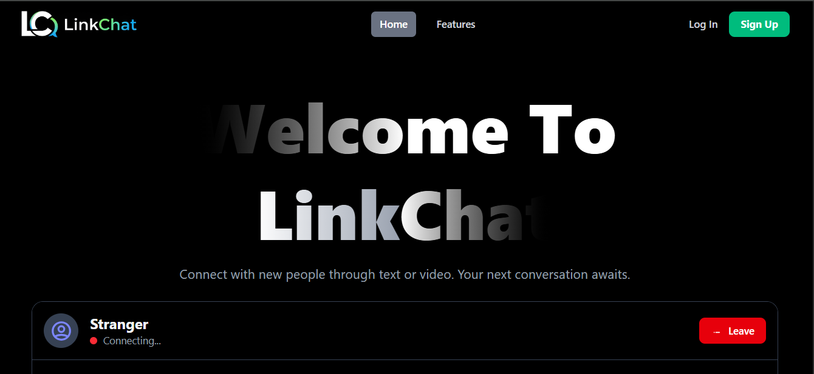
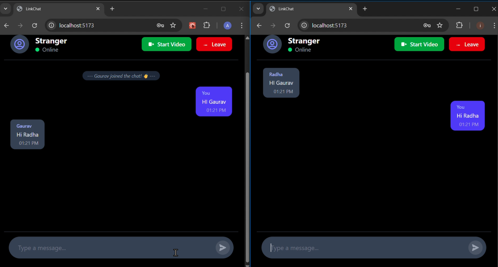

# 🔗 LinkChat -  https://link-chat-main.vercel.app/

**Connect Instantly, Chat Anonymously. Real-time anonymous chat and video calls.**

LinkChat is a full-stack web application designed to connect people from around the world for spontaneous conversations. It provides a platform for anonymous users to engage in real-time text chat and initiate secure, peer-to-peer video calls.

## ✨ Features

-   **Real-Time Text Chat:** Instant messaging with a randomly connected partner.
-   **Anonymous User Matching:** Connect with a new stranger for each session.
-   **Peer-to-Peer (P2P) Video Calls:** High-quality, low-latency video and audio streaming directly between users using WebRTC.
-   **Secure Authentication:** User accounts and WebSocket connections are secured using JWT (JSON Web Tokens).
-   **Live Connection Status:** The UI provides real-time feedback on the connection status.
-   **Responsive Design:** A clean and modern interface that works seamlessly on both desktop and mobile devices.

## 🛠️ Tech Stack

-   **Backend:**
    -   Python, Django, Django REST Framework
    -   Django Channels for WebSocket handling
    -   Daphne / Uvicorn as the ASGI server
    -   Redis for the Channel Layer message broker
-   **Frontend:**
    -   React, TypeScript
    -   Vite for a fast development experience
    -   Tailwind CSS for styling
-   **Real-time Communication:**
    -   **WebSockets:** For signaling and text chat.
    -   **WebRTC:** For peer-to-peer audio and video communication.

🤝 **Contributing**
Contributions are what make the open-source community such an amazing place to learn, inspire, and create. Any contributions you make are greatly appreciated.
Fork the Project
Create your Feature Branch (git checkout -b feature/AmazingFeature)
Commit your Changes (git commit -m 'Add some AmazingFeature')
Push to the Branch (git push origin feature/AmazingFeature)
Open a Pull Request

📜 **License**
Distributed under the MIT License. See LICENSE for more information.
